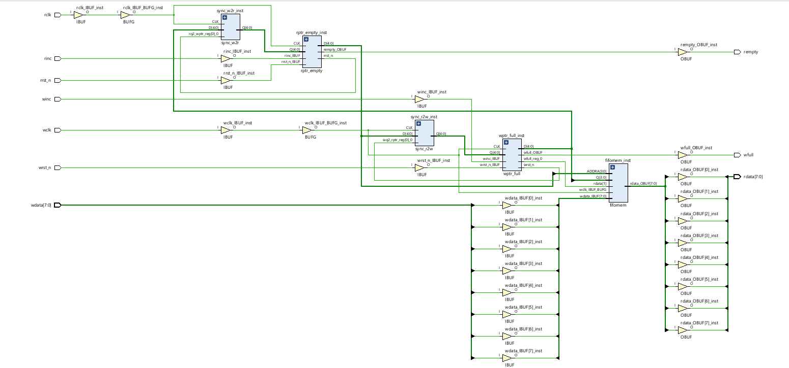
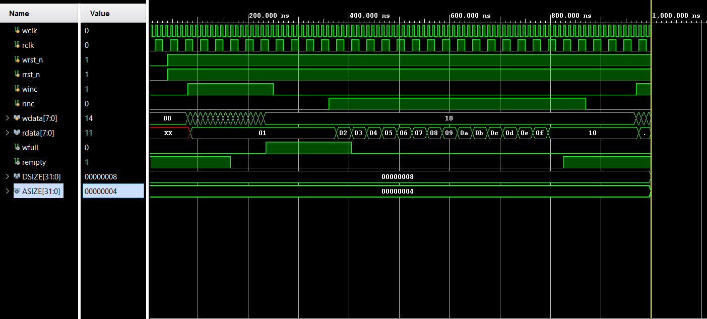
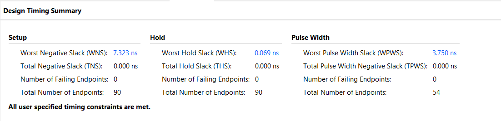
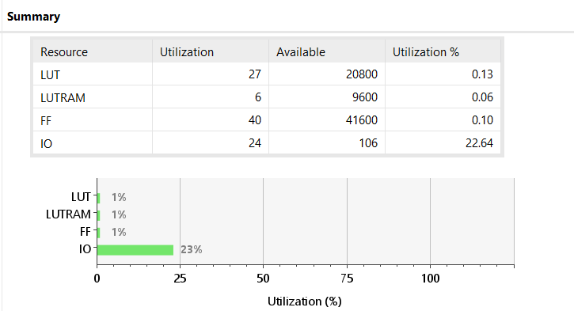
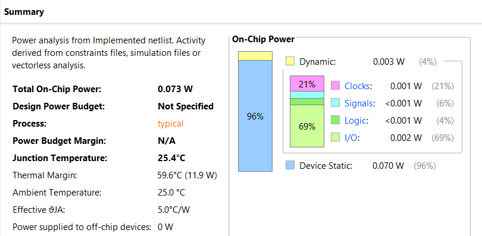
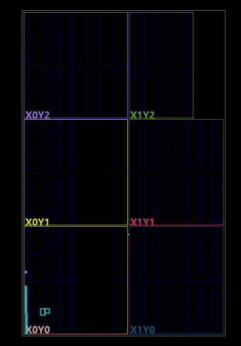

# Asynchronous FIFO with Clock Domain Crossing (CDC)

Modern System-on-Chips (SoCs) are rarely driven by a single clock. You usually have a high-speed processor talking to a slower peripheral, or vice versa. When you try to pass multi-bit binary data directly between two independent clock domains, you inevitably hit **metastability**—signals get sampled mid-transition, resulting in garbage data and catastrophic system failure. 

I built this **Asynchronous FIFO** to solve that exact problem. It acts as an elastic buffer, safely swallowing data from a fast transmitter and holding it until a slow receiver is ready to read it, ensuring 100% data integrity across clock boundaries.

This repository documents my end-to-end VLSI design flow: from RTL architecture and Verilog coding, to race-condition-free Verification, and finally, Physical Implementation and Timing Closure on a Xilinx FPGA.

---

## 1. Architecture & RTL Design

I structured the RTL to be highly modular, breaking it down into five distinct blocks (as seen in the RTL Schematic):
1. **Dual-Port RAM (`fifomem`):** The core memory buffer with independent read and write ports.
2. **Write Pointer & Full Logic (`wptr_full`):** Tracks the write address and asserts the `wfull` flag to prevent overflow.
3. **Read Pointer & Empty Logic (`rptr_empty`):** Tracks the read address and asserts the `rempty` flag to prevent underflow.
4. **Read-to-Write Synchronizer (`sync_r2w`):** 2-stage flip-flop synchronizer.
5. **Write-to-Read Synchronizer (`sync_w2r`):** 2-stage flip-flop synchronizer.

**The Multi-Bit Transition Fix:** You can't pass standard binary pointers across clock domains. To fix this, I implemented **Binary-to-Gray code converters** in the pointer logic. Since Gray code only changes one bit at a time, passing it through the 2-stage synchronizers guarantees that the receiving clock domain never samples a metastable or corrupted pointer value.

---

## 2. Verification (Testbench & Simulation)

To prove the CDC logic works, I couldn't just use standard synchronous testing. I wrote a robust testbench (`tb_async_fifo.v`) to aggressively stress the design.

* **Asynchronous Clocks:** I generated a 100 MHz write clock and a 33.33 MHz read clock. 
* **Fixing Delta-Cycle Race Conditions:** Initially, driving the stimulus on the positive clock edge caused simulator race conditions with the DUT. I engineered the testbench to drive all inputs (`winc`, `rinc`, `wdata`) strictly on the **falling edge (`negedge`)** of the clocks. This ensured the data was perfectly stable before the RTL sampled it on the rising edge.
* **The Stress Test:** The waveform below proves the design can handle continuous burst writes until the `wfull` flag triggers, followed by burst reads until `rempty` triggers, and finally, simultaneous read/write operations without dropping a single byte.

---

## 3. Physical Design & Implementation Results

I synthesized and implemented this design in Vivado, targeting a Xilinx Artix-7/Zynq-7000 architecture. Writing Verilog is only half the battle; proving it works in physical silicon physics is the other.

### Timing Closure (Static Timing Analysis)
I wrote an `.xdc` constraint file defining the 10ns and 30ns clocks, and explicitly set the `set_clock_groups -asynchronous` constraint to tell the timing engine how to handle the CDC paths. The design cleanly met all timing requirements with zero failing endpoints:
* **Worst Negative Slack (Setup WNS):** `+7.323 ns`
* **Worst Hold Slack (Hold WHS):** `+0.069 ns`

### Area & Resource Utilization
Because the design is heavily optimized, the silicon footprint is incredibly small. The physical implementation consumed:
* **LUTs (Look-Up Tables):** 27 (0.13% utilization)
* **Registers (Flip-Flops):** 40 (0.10% utilization)
* **Distributed RAM (LUTRAM):** 6 (0.06% utilization)

### Power Consumption
The implementation is highly power-efficient. Based on the implemented netlist and vectorless activity analysis, the total on-chip power is barely registering:
* **Total On-Chip Power:** `0.073 W` (73 mW)
* **Dynamic Power:** `0.003 W` (Mostly I/O and Clock trees)
* **Static Power:** `0.070 W`

### Device Routing
Taking a look at the physical FPGA die post-implementation, you can see Vivado successfully placed the logic cells within the `X0Y0` and `X0Y1` clock regions, efficiently routing the Gray-coded pointers between the write and read domain synchronizers.

